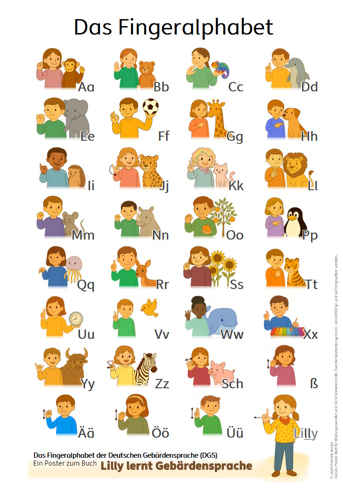
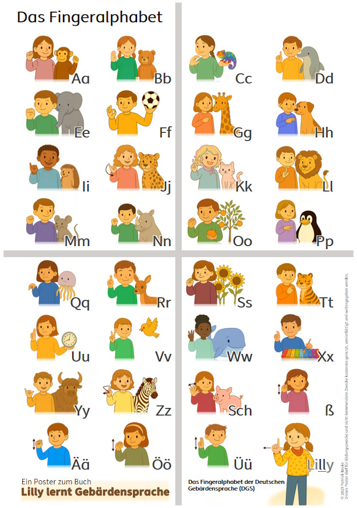

# Poster: Fingeralphabet in DGS

Diese beiden Poster gehören zum Bilderbuch **„Lilly lernt Gebärdensprache“**.  
Sie zeigen das Fingeralphabet der Deutschen Gebärdensprache (DGS) und dürfen **für Bildungszwecke kostenlos genutzt und weitergegeben** werden.

## 📥 Download

  
▶️ **[PDF öffnen – A2-Version](FingeralphabetA2.pdf)**

  
▶️ **[PDF öffnen – 4×A4-Version](FingeralphabetA4.pdf)**
